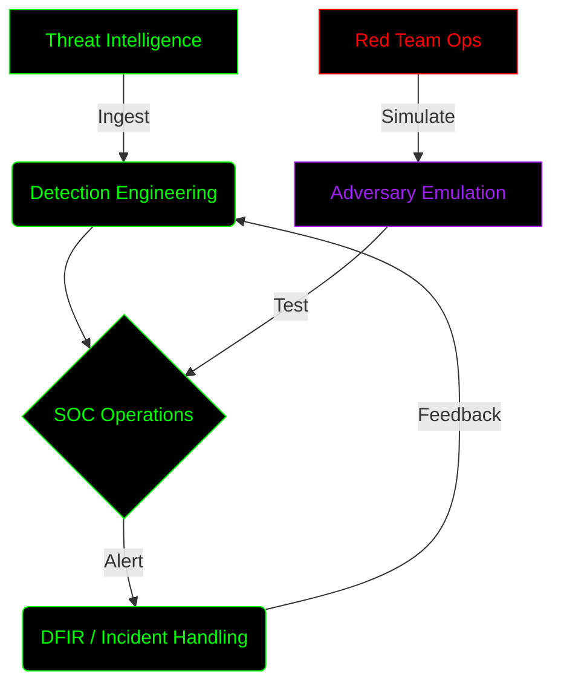

<div align="center">

```text
  ██████╗██╗  ██╗ █████╗ ██████╗  ██████╗ ███╗   ██╗
 ██╔════╝██║  ██║██╔══██╗██╔══██╗██╔═══██╗████╗  ██║
 ██║     ███████║███████║██████╔╝██║   ██║██╔██╗ ██║
 ██║     ██╔══██║██╔══██║██╔══██╗██║   ██║██║╚██╗██║
 ╚██████╗██║  ██║██║  ██║██║  ██║╚██████╔╝██║ ╚████║
  ╚═════╝╚═╝  ╚═╝╚═╝  ╚═╝╚═╝  ╚═╝ ╚═════╝ ╚═╝  ╚═══╝
```


</div>

<div align="center">
  <a href="https://char0n1507.github.io/Protfilio2.0/"></a>
  <a href="https://linkedin.com/in/sricharan-pedhiti"></a>
  <a href="mailto:sricharan.pedhiti@gmail.com"></a>
</div>

---

<table width="100%">
<tr>
<td width="50%" valign="top">

### ⚠️ **USER PROFILE: SRI CHARAN PEDHITI**
```yaml
Class: Cybersecurity Specialist
Clearance: Level 5
Specialty: Detection Engineering & Threat Hunting
Alias: Char0n
Status: Active
HTB: Pro Hacker ⬡
THM: Top 1% 🔥
```
</td>
<td width="50%" valign="top">

### 🎯 **TACTICAL EXPERTISE**
- 🛡️ **Defensive**: DFIR, Threat Hunting, SOC Operations
- ⚔️ **Offensive**: Pentesting, Red Team Ops, Exploit Dev
- 🟣 **Purple Team**: Adversary Emulation, MITRE ATT&CK
</td>
</tr>
</table>

---

### 📂 **ACTIVE OPERATIONS [PROJECTS]**
*Executing `/bin/projects/list.sh`...*

| 🟢 Status | Operation Code | Description | Tech Stack |
|:---:|:---|:---|:---|
| `[ACTIVE]` | [**C.O.R.E.**](https://github.com/Char0n1507/C.O.R.E) | **Enterprise AI SOC Agent** <br> Automates detection, triage & response via LLMs. | `Python` `AI/LLM` `Automation` |
| `[ACTIVE]` | [**ARGUS**](https://github.com/Char0n1507/ARGUS) | **Next-Gen NDR** <br> Unsupervised Deep Learning to detect zero-day exploits. | `Python` `TensorFlow` `Scapy` |
| `[DEPLOYED]` | [**EREBUS**](https://github.com/Char0n1507/EREBUS) | **Dark Web OSINT** <br> AI-Powered Tor crawling + local LLMs (Ollama). | `Python` `Tor` `LLM` `Streamlit` |
| `[MAINTAIN]` | [**Omnisearch**](https://github.com/Char0n1507/Omnisearch) | **Attack Surface Mapping** <br> All-in-one passive recon & web probing utility. | `Python` `OSINT` `Recon` |

---

### 🧰 **CAPABILITY MATRIX**
*Loading module `/skills/arsenal.json`...*

<details>
<summary><b>[+] EXPAND: OFFENSIVE SECURITY</b></summary>
<br>


</details>

<details>
<summary><b>[+] EXPAND: DEFENSIVE SECURITY</b></summary>
<br>


</details>

<details>
<summary><b>[+] EXPAND: PURPLE TEAM & ENGINEERING</b></summary>
<br>


</details>

---

### ⚙️ **OPERATIONAL METHODOLOGY**



---

### 📊 **SYSTEM TELEMETRY [GITHUB STATS]**

<div align="center">
  
  
</div>

<br>

<div align="center">
  
</div>

---

### 🌐 **CTF CLEARANCES**

<div align="center">
  <a href="https://app.hackthebox.com/users/2063634">
    
  </a>
  &nbsp;&nbsp;
  <a href="https://tryhackme.com/p/Char0n1507">
    
  </a>
</div>

<div align="center">
  <br>
  <b><a href="https://app.gitbook.com/o/OzCeXZoR6hIZ3S7aPLrj/s/d1x5yxrrjMQ55ObqBQ44" style="color: #00FF00;">[ DECRYPT CTF WRITEUPS ON GITBOOK ]</a></b>
</div>

---
<div align="center">
<code>[ CONNECTION TERMINATED ] ░░░░░░░░░░░░░░░░░░░░░░░░░░░░░░░░░░░░░░░ 100%</code>

<br>

*"The quieter you become, the more you can hear."*
</div>
